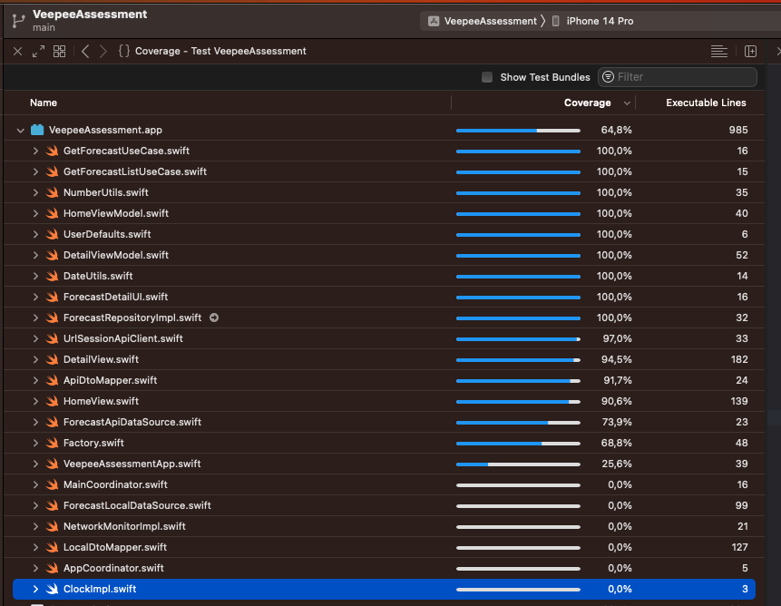

# Veepee Assessment
[](https://app.bitrise.io/app/2090efaaa9c5b60f)
[](https://codecov.io/gh/yeniel/CabifyMobileChallenge)
[](https://swift.org)
[](https://apple.com)

This is my implementation of a the Veepee Assessment. The specification readme is [here](ReadmeAssets/specifications.md).

VIDEO!!!!

## Table of contents
1. [Installation](#installation)
2. [Pods and Packages](#pods-and-packages)
3. [Architecture and Design Patterns](#architecture-and-design-patterns)
4. [Unit Tests](#unit-tests)
5. [CI](#ci)
6. [Known Issues](#known-issues)


## Installation
1. Download the project:
```
git clone https://github.com/yeniel/VeepeeAssessment
```
2. Wait until all Swift Package Manager are fetched.

## Pods and Packages
1. CocoaPods
	- [SwiftLint](https://github.com/realm/SwiftLint): Linter I have used to static code analysis. 
2. Swift Package Manager
	- [Factory](https://github.com/hmlongco/Factory): Dependency injector, based on container-based dependency injection pattern.
	- [Stinsen](https://github.com/rundfunk47/stinsen): Router based on coordinator pattern.
	- [Quick](https://github.com/Quick/Quick): Unit tests.
	- [Nimble](https://github.com/Quick/Nimble): Unit test assertions.
	- [SnapshotTesting](https://github.com/pointfreeco/swift-snapshot-testing): Snapshot tests for views.
	- [OHHTTPStubs](https://github.com/AliSoftware/OHHTTPStubs): Stub network requests to test data layer.

## Architecture and Design Patterns
First of all, I want to say that when I thought this app it was as a big project. Therefore this project, in the future, could have more features, and all the current ones could be more complex.
In some parts the design patterns seem like an overkill or maybe add needless complexity, but I chose them to show my knowledge.

I tried to follow the bases of a **Clean Architecture** and the **SOLID** principles. The intention is to have a testable, robust and scalable code and avoid bad smells like:
- God entities.
- Repeated code.
- Non testable code.
- Coupled code.
- Lower cohesion.

### Data Layer
#### Repositories
I implemented the **repository pattern** for products and order requests. The repository pattern is good to manage collection of items.

For the forecast list, I implemented two concreate data source, one is the api data source to get data from the OpenWeatherMapApi; and the other is a local data source to get data from CoreData.
The cache logic have was be added in the repository class. The cached expired every 3 hours, I took this interval because in the smallest interval between two forecasts in the API.
We could add also a memory data source or just cache in memory in the repository class. But for this small project with only one request is not needed.

The concrete implementation of the api client is based in `URLSession`.

#### Dtos
I used data transfer object to parse the json of the api responses using the `Codable` protocol.

#### Dto Mapper
A mapper to map the dtos to domain models.

#### Errors
The `ApiClientError` is used to map the API errors. The `CoreData` errors are only catched.

### Domain Layer
#### Models
Core models of the business.

#### Errors
The model `DomainError` is used specify business errors like forecast not found.

#### Use Cases
If this project was scalated I would add the business logic in the use cases, to diferentiate it from the presentation logic. In the use cases I also map data errors to domain erros. 
Use cases helps me to **deacoplate** the layers. The comunication between the presentation layer and data layer is made throught the use cases (I don't have any repository in viewmodels).

### Presentation Layer
I implemented the **MVVM pattern**. The views are in **SwiftUI** and I used **Async/Await** through all the app for asynch process.

#### ViewModels
The view models contain the presentation logic.

#### Routing
I used the *Stinsen* package to deacoplate the navigation logic from the views using the coordinator pattern. This approach helps me to test better in case I have to add more complexity to the navigation in the future.

#### UI Models
I mapped domain models to ui models (`ForecastUI` and `ForecastDetailUI`). The intention is to give the views a more specific models and avoid adding logic to it (eg. measurement formats). Also give the view only the data that it needs.

## Unit Tests

I used *Quick* for all tests and *Nimble* for the assertions. The `ObjectMother` provides me mocked models. I try to follow as much as I can **FIRST** principles.

To increase the speed I change a little the entry point of the app, in `VeepeeAssessmentApp.swift`.
I cut the app to a simple view in case we are running the tests.

### Scheme Configuration

I configured the scheme to randomize the execution order.

I set the App Language to English and the Region to Spain.

### Coverage

The **coverage** is **64,8%**



### Subjects Under Test

#### Data
- Repositories: Test cache logic and map dto to domain model.
- UrlSessionApiClient: Test json parse to Codable Dtos. I used OHHTTPStubs to stub request using mocked jsons.

#### Domain
- Use Cases: Test business logic, erros.

#### Presentation
- ViewModels: Test presentation logic.
- Views: Snapshots to test all the design. The snapshot images are in [Snapsgots](VeepeeAssessmentTests/Presentation/Snapshots/)

## CI
I chose **Bitrise** as CI. I created a workflow with a trigger on every push on main branch. You can see the badge of the status in the top of this README, and if you click on it you will see the Bitrise builds. There also a badge of code coverage.

I added the following steps:
1. Build.
2. Run tests.
3. Send coverage to [Codecov](https://about.codecov.io/)

## Known Issues
In the console appears the message:

 *NavigationLink presenting a value must appear inside a NavigationContent-based NavigationView. Link will be disabled.*.

Tracking issue [here](https://github.com/rundfunk47/stinsen/issues/29#issuecomment-1194301980)


